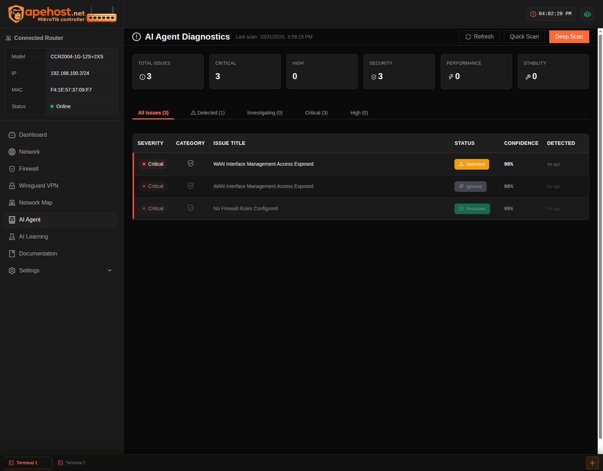

# MikroTik Router Management Dashboard

> [!WARNING]
> **Work In Progress - Not Production Ready**
>
> This project is under active development and is **NOT ready for production use**. Features are incomplete, bugs are expected, and breaking changes may occur without notice. Use at your own risk.
>
> - Security features are not fully implemented
> - API stability is not guaranteed
> - Data loss may occur during updates
> - Not all features are fully functional

Web-based management interface for MikroTik routers with AI-powered network diagnostics and troubleshooting capabilities.

## Interface Overview

The dashboard provides multiple specialized views for comprehensive network management:

### Dashboard
Real-time router metrics, system resource monitoring, interface status overview, and traffic statistics at a glance.


### AI Agent Diagnostics
Claude-powered network troubleshooting with automated issue detection, confidence scoring, and actionable recommendations. Features 14 specialized MCP tools for deep network analysis.



### Network Interfaces
Comprehensive interface management with detailed configuration options, traffic monitoring, and status indicators. Toggle interfaces on/off and view real-time statistics.


### Additional Pages

- **Chat**: Interactive AI assistant for natural language network queries
- **Analytics**: Traffic analysis, usage patterns, and historical data visualization
- **Firewall**: Firewall rule management and connection tracking
- **Network Map**: Visual topology mapping and device discovery
- **Documentation**: Built-in help system and API reference
- **Learning Dashboard**: Network education resources and tutorials
- **Settings**: System configuration, API credentials, and preferences
- **Terminal**: Direct router CLI access with command history

## Core Features

- **AI-Powered Diagnostics**: Claude-based network troubleshooting with 14 specialized MCP tools
- **Real-Time Monitoring**: Live router metrics (CPU, memory, uptime, traffic)
- **Interface Management**: Configure and monitor all network interfaces
- **Firewall Analysis**: Automatic path analysis and blocking rule identification
- **Network Diagnostics**: Ping, traceroute, ARP lookups, DNS resolution, DHCP lease tracking
- **Systematic Troubleshooting**: 5-phase diagnostic workflow for connectivity issues
- **Dark Theme UI**: WCAG 2.1 AA compliant, responsive design

## Quick Start

### Prerequisites
- Node.js 18+
- MikroTik router with API access
- Claude API key (Anthropic)

### Frontend Setup
```bash
npm install
npm run dev       # Development server on port 5173
npm run build     # Production build
```

### Backend Setup
```bash
cd server
npm install
cp .env.example .env
# Configure .env with:
# - MikroTik router credentials
# - Claude API key
# - Server settings
npm run dev       # Backend server on port 3000
```

### Full Stack Development
```bash
npm run dev:full  # Runs frontend and backend concurrently
```

## Tech Stack

**Frontend**
- React 18 + TypeScript 5
- CSS Modules with custom properties
- Vite 5 build system
- Atomic design architecture

**Backend**
- Node.js + Express + TypeScript
- MikroTik RouterOS API client
- Claude AI SDK (Anthropic)
- WebSocket for real-time updates
- MCP (Model Context Protocol) tools

## Project Structure

```
src/
├── components/
│   ├── atoms/              # Input, Button, StatusBadge
│   ├── molecules/          # RouterInfo, ChatMessage, QuickAction
│   └── organisms/          # Sidebar, Header, ChatPanel, TerminalPanel
├── pages/                  # Dashboard, Network, Firewall, Settings
├── styles/
│   ├── tokens.css         # Design system variables
│   └── reset.css          # CSS normalization
├── types/                  # TypeScript interfaces
└── hooks/                  # React hooks

server/
├── src/
│   ├── mcp/               # MCP tool implementations
│   ├── routes/            # API endpoints
│   ├── services/          # Business logic
│   └── utils/             # Helper functions
└── MCP_TOOLS_QUICK_REFERENCE.md
```

## AI Assistant Capabilities

**Diagnostic Tools**
- Firewall path analysis with exact blocking rule identification
- Connectivity testing (ping, traceroute) with quality metrics
- Network layer inspection (ARP, DNS, DHCP)
- Interface status and traffic analysis
- System resource monitoring

**Troubleshooting Workflow**
1. Initial assessment and symptom collection
2. Layer-by-layer network analysis
3. Firewall rule path testing (80% of connectivity issues)
4. Interface and routing verification
5. Confidence-scored recommendations

**Natural Language Interface**
- Plain English query support
- Automatic tool selection based on context
- Detailed technical explanations
- Actionable remediation steps

See [server/MCP_TOOLS_QUICK_REFERENCE.md](server/MCP_TOOLS_QUICK_REFERENCE.md) for complete tool documentation.

## Design System

**Theme**: Dark background (#0a0a0a) with orange accent (#ff6b35)

**Typography**
- UI: Arial
- Terminal: Consolas

**Spacing Scale**: 4px, 8px, 12px, 16px, 24px, 32px

**Layout**
- Fixed sidebar: 260px
- Content split: 50/50 flexible
- Mobile-first responsive breakpoints

**Customization**: Edit `src/styles/tokens.css` to modify design tokens.

## Configuration

### Environment Variables

**Frontend** (`.env`)
```
VITE_API_URL=http://localhost:3000
VITE_WS_URL=ws://localhost:3000
```

**Backend** (`server/.env`)
```
# MikroTik Router
MIKROTIK_HOST=192.168.x.x
MIKROTIK_PORT=8728
MIKROTIK_USERNAME=admin
MIKROTIK_PASSWORD=

# Claude AI
ANTHROPIC_API_KEY=sk-ant-...

# Server
PORT=3000
NODE_ENV=development
```

## Development

**Code Quality**
- Full TypeScript coverage
- ESLint configuration
- CSS Modules (no Tailwind dependency)
- Atomic design methodology

**Performance**
- Code splitting ready
- Vite HMR for fast development
- WebSocket for efficient real-time updates

## License

MIT
